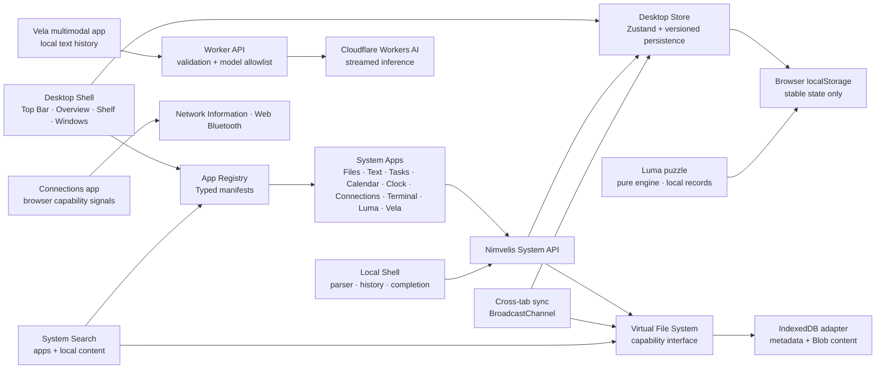

# Nimvelis Aurora 0.8 architecture

Nimvelis is a long-running browser SPA with a small edge API. Aurora 0.8 preserves the local
desktop boundaries while adding Vela through a native Cloudflare Workers AI binding. It still has
no account, remote file storage, or collaboration code.

## Boundaries

- `src/kernel/window-manager` owns normalized window types and pure geometry functions.
- `src/kernel/desktop-layout.ts` defines the usable windowing viewport. Normal and maximized
  windows stay above the floating Shelf; fullscreen windows intentionally cover shell chrome.
- `src/kernel/shelf` owns pure order normalization and movement helpers. Shelf customization never
  mutates the installed application registry.
- `src/kernel/app-registry` is the only list of installed applications. A manifest defines the
  component, identity, initial size, minimum size, permissions, and instance policy.
- `src/state/desktop-store.ts` owns durable desktop state, named workspaces, desktop icon
  positions, system preferences, snapping, and window lifecycle actions. `productivity-store.ts`
  owns local tasks and calendar events; `system-store.ts` owns durable notification history.
- `src/shell` turns the kernel state into the desktop UI and implements Pointer Events.
- `src/apps` receives a window record and a capability-shaped System API. Apps do not import or
  mutate the desktop store.
- `src/kernel/vfs` defines the storage contract. The in-memory implementation supports tests and
  future adapters; the IndexedDB implementation is the browser default.
- `src/shell/SystemSearch.tsx` owns transient global search UI and queries the registry plus VFS.
- `src/kernel/time.ts` validates display-time preferences and keeps time-zone-aware date keys
  consistent between the menu bar, Clock, Calendar, and Settings.
- `src/apps/connections` reads online/network estimates and starts Web Bluetooth only after an
  explicit click. It has no access to Wi-Fi credentials or operating-system network controls.
- `src/apps/terminal` parses a fixed local command set. File commands use only the VFS capability;
  app, appearance, and time-zone commands use explicit System API methods. It cannot spawn host
  processes, access environment secrets, make remote shell connections, or run arbitrary code.
- `src/apps/luma` contains a deterministic puzzle generator and solver plus the keyboard- and
  touch-friendly system game. It has no network or system capability and stores only best scores.
- `src/design` and `src/styles` own original Nimvelis icons and shared design tokens.
- `worker/index.ts` is the only remote inference boundary. It validates chat size and roles,
  rate-limits per edge isolate, maps a short model key through an allowlist, and streams Workers AI.

## Window lifecycle

Every open window is a `WindowInstance` with a unique ID, application ID, workspace ID, stable
bounds, visual state, z-index, focus flag, and optional instance data.

1. A launcher asks the store to open an application ID.
2. The store resolves the manifest and enforces its single- or multi-instance policy.
3. The shell renders the registered component inside `SystemWindow`.
4. Focus increments a monotonic z-index and clears focus from the other windows.
5. Minimize remembers the previous visual state; restore returns to it.
6. Maximize and fullscreen retain the normal bounds so the window can return to its previous
   position and size.

## Pointer interaction

Move and resize start from a Pointer Event and capture that pointer. During the gesture:

- coordinates live in a mutable interaction ref;
- `requestAnimationFrame` applies `transform`, width, and height directly to the window element;
- geometry helpers constrain the visible titlebar and minimum application size;
- Zustand is not updated on each `pointermove`.

The final bounds are committed once on `pointerup` or `pointercancel`. Desktop icons use the same
pointer-capture and animation-frame pattern, clamp to the usable desktop, and persist only the
final position. Shelf icons use a separate Pointer Event gesture, commit only the final app order,
and remain operable through context-menu move commands. The titlebar also supports
keyboard movement with `Alt + Arrow`, keyboard resizing with `Alt + Shift + Arrow`, and maximize
with `Alt + Enter`.

## Persistence

The Zustand `persist` middleware stores only stable user state:

- open windows and their stable bounds/state/data;
- the z-index counter;
- appearance mode;
- wallpaper choice;
- welcome completion;
- named workspaces and the active workspace;
- desktop icon positions;
- Shelf app order plus interface, clock, time zone, week-start, desktop, and accessibility
  preferences;
- each Terminal window's current VFS folder in its normal window instance data.

Transient pointer data, animation state, menu state, current time, and resolved system color
scheme are not persisted. Rehydration validates records, application IDs, bounds, visual states,
and preferences before merging them with current defaults. The storage record is versioned so a
future release can migrate it.

Files use a separate IndexedDB database. Metadata and Blob content are exposed only through the
`VirtualFileSystem` interface. Directories and file names are unique per folder, deleting a
directory treats its descendants as one tree, and Trash keeps recoverable records until they are
permanently removed. The search boundary reads names and the contents of small text-compatible
files; it ignores trashed items.

`BroadcastChannel` synchronizes stable desktop state, local tasks and calendar events,
notification history, and VFS change signals between same-origin tabs. Every IndexedDB write
remains the source of truth; receiving tabs reload records from IndexedDB instead of transferring
file Blobs through the channel.

The production service worker caches the application shell and same-origin built assets. Waiting
workers are surfaced through Device space so the user controls when to refresh. It does not cache
or upload virtual-file content: IndexedDB remains the source of truth for local files.

Vela stores completed text messages in localStorage. Sending a message posts only the visible
conversation slice and, when the user explicitly chooses one, a browser-scaled image to
`/api/vela/chat`; it has no VFS capability and cannot read files or device details. Attached image
data remains session-only. The Worker holds the system prompt and Cloudflare model IDs, validates
image MIME type and decoded size, rejects unsupported models and cross-origin browser requests,
and returns a no-store SSE stream.

Connections does not persist Bluetooth devices or network details. Network estimates are read
from the browser when available, and the latency check fetches a same-origin static manifest with
`no-store`. Bluetooth selection and connection are delegated to the browser's permission UI and
last only for the active session. Time-zone preferences affect Nimvelis formatting; the device
clock remains read-only.

Terminal transcripts are session-only. Its bounded command history is stored in localStorage, and
each window persists only its current VFS folder ID through ordinary window instance data. All
file reads and mutations go through `VirtualFileSystem`; `rm` maps to recoverable Trash and there
is no permanent-delete, host-shell, `eval`, network-fetch, environment-variable, or secret API in
the command environment.

## Future adapters

Cloud metadata, object storage, and synchronization can be implemented as separate adapters
without changing the window manager or application components. Workers AI is isolated to Vela and
does not change the local file-system contract.
