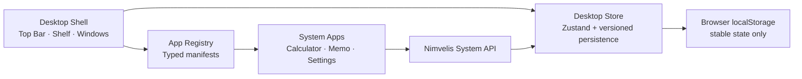

# Nimvelis Aurora 0.1 architecture

Nimvelis is a long-running browser SPA. Aurora 0.1 deliberately stops at the local desktop
kernel: it has no account, remote storage, AI, or collaboration code.

## Boundaries

- `src/kernel/window-manager` owns normalized window types and pure geometry functions.
- `src/kernel/app-registry` is the only list of installed applications. A manifest defines the
  component, identity, initial size, minimum size, permissions, and instance policy.
- `src/state/desktop-store.ts` owns durable desktop state and window lifecycle actions.
- `src/shell` turns the kernel state into the desktop UI and implements Pointer Events.
- `src/apps` receives a window record and a capability-shaped System API. Apps do not import or
  mutate the desktop store.
- `src/design` and `src/styles` own original Nimvelis icons and shared design tokens.

## Window lifecycle

Every open window is a `WindowInstance` with a unique ID, application ID, stable bounds,
visual state, z-index, focus flag, and optional instance data.

1. A launcher asks the store to open an application ID.
2. The store resolves the manifest and enforces its single- or multi-instance policy.
3. The shell renders the registered component inside `SystemWindow`.
4. Focus increments a monotonic z-index and clears focus from the other windows.
5. Minimize remembers the previous visual state; restore returns to it.
6. Maximize and fullscreen retain the normal bounds so the window can return to its previous
   position and size.

## Pointer interaction

Move and resize start from a Pointer Event and capture that pointer. During the gesture:

- coordinates live in a mutable interaction ref;
- `requestAnimationFrame` applies `transform`, width, and height directly to the window element;
- geometry helpers constrain the visible titlebar and minimum application size;
- Zustand is not updated on each `pointermove`.

The final bounds are committed once on `pointerup` or `pointercancel`. The titlebar also supports
keyboard movement with `Alt + Arrow`, keyboard resizing with `Alt + Shift + Arrow`, and maximize
with `Alt + Enter`.

## Persistence

The Zustand `persist` middleware stores only stable user state:

- open windows and their stable bounds/state/data;
- the z-index counter;
- appearance mode;
- wallpaper choice;
- welcome completion.

Transient pointer data, animation state, menu state, current time, and resolved system color
scheme are not persisted. Rehydration validates records, application IDs, bounds, visual states,
and preferences before merging them with current defaults. The storage record is versioned so a
future release can migrate it.

## Future adapters

Milestone 1 can add IndexedDB-backed virtual files behind a `VirtualFileSystem` interface without
changing the window manager. Cloud metadata, object storage, and synchronization remain separate
future adapters; no cloud assumptions are embedded in the Aurora 0.1 system apps.
