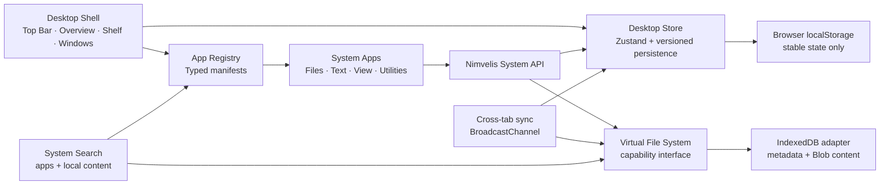

# Nimvelis Aurora 0.3 architecture

Nimvelis is a long-running browser SPA. Aurora 0.3 adds a usable local workspace while preserving
the desktop kernel boundaries. It still has no account, remote storage, AI, or collaboration code.

## Boundaries

- `src/kernel/window-manager` owns normalized window types and pure geometry functions.
- `src/kernel/app-registry` is the only list of installed applications. A manifest defines the
  component, identity, initial size, minimum size, permissions, and instance policy.
- `src/state/desktop-store.ts` owns durable desktop state, named workspaces, snapping, and window
  lifecycle actions. `system-store.ts` owns durable notification history.
- `src/shell` turns the kernel state into the desktop UI and implements Pointer Events.
- `src/apps` receives a window record and a capability-shaped System API. Apps do not import or
  mutate the desktop store.
- `src/kernel/vfs` defines the storage contract. The in-memory implementation supports tests and
  future adapters; the IndexedDB implementation is the browser default.
- `src/shell/SystemSearch.tsx` owns transient global search UI and queries the registry plus VFS.
- `src/design` and `src/styles` own original Nimvelis icons and shared design tokens.

## Window lifecycle

Every open window is a `WindowInstance` with a unique ID, application ID, workspace ID, stable
bounds, visual state, z-index, focus flag, and optional instance data.

1. A launcher asks the store to open an application ID.
2. The store resolves the manifest and enforces its single- or multi-instance policy.
3. The shell renders the registered component inside `SystemWindow`.
4. Focus increments a monotonic z-index and clears focus from the other windows.
5. Minimize remembers the previous visual state; restore returns to it.
6. Maximize and fullscreen retain the normal bounds so the window can return to its previous
   position and size.

## Pointer interaction

Move and resize start from a Pointer Event and capture that pointer. During the gesture:

- coordinates live in a mutable interaction ref;
- `requestAnimationFrame` applies `transform`, width, and height directly to the window element;
- geometry helpers constrain the visible titlebar and minimum application size;
- Zustand is not updated on each `pointermove`.

The final bounds are committed once on `pointerup` or `pointercancel`. The titlebar also supports
keyboard movement with `Alt + Arrow`, keyboard resizing with `Alt + Shift + Arrow`, and maximize
with `Alt + Enter`.

## Persistence

The Zustand `persist` middleware stores only stable user state:

- open windows and their stable bounds/state/data;
- the z-index counter;
- appearance mode;
- wallpaper choice;
- welcome completion.
- named workspaces and the active workspace.

Transient pointer data, animation state, menu state, current time, and resolved system color
scheme are not persisted. Rehydration validates records, application IDs, bounds, visual states,
and preferences before merging them with current defaults. The storage record is versioned so a
future release can migrate it.

Files use a separate IndexedDB database. Metadata and Blob content are exposed only through the
`VirtualFileSystem` interface. Directories and file names are unique per folder, deleting a
directory treats its descendants as one tree, and Trash keeps recoverable records until they are
permanently removed. The search boundary reads names and the contents of small text-compatible
files; it ignores trashed items.

`BroadcastChannel` synchronizes stable desktop state, notification history, and VFS change
signals between same-origin tabs. Every IndexedDB write remains the source of truth; receiving
tabs reload records from IndexedDB instead of transferring file Blobs through the channel.

The production service worker caches the application shell and same-origin built assets. Waiting
workers are surfaced through Device space so the user controls when to refresh. It does not cache
or upload virtual-file content: IndexedDB remains the source of truth for local files.

## Future adapters

Cloud metadata, object storage, and synchronization can be implemented as separate adapters
without changing the window manager or application components. No cloud assumptions are embedded
in the Aurora 0.3 system apps.
